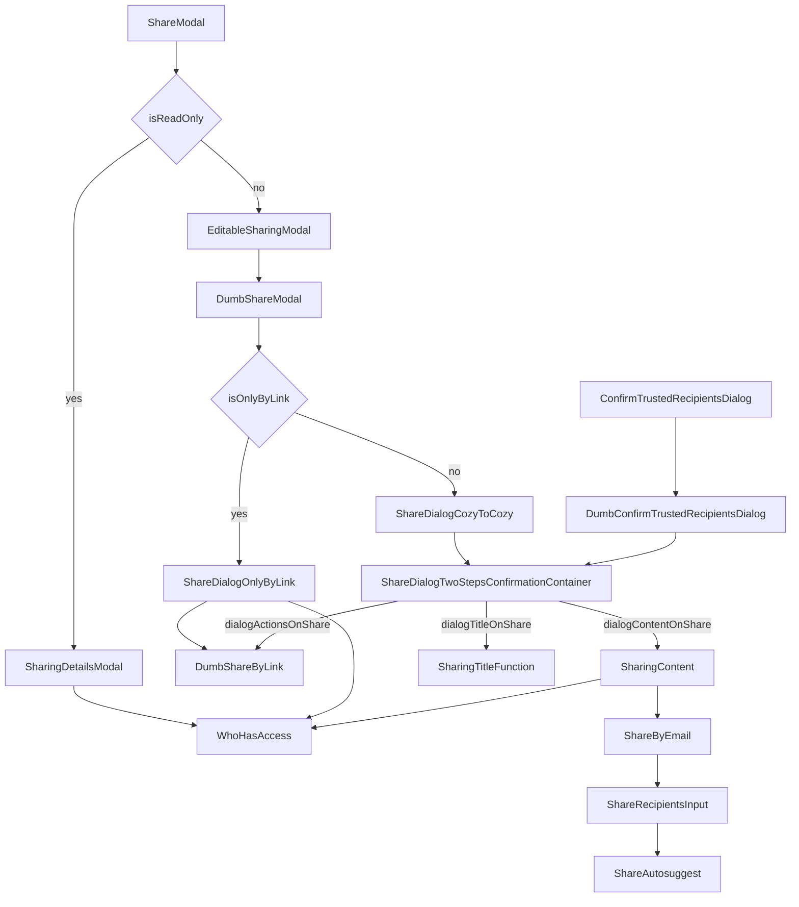
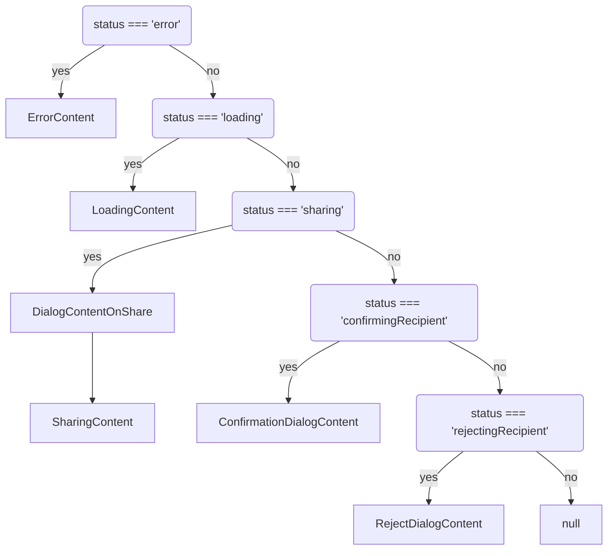

# ShareModal architecture

```mermaid
flowchart TD
    ShareModal --> ShareModalConditions{isReadOnly}
    ShareModalConditions --> |yes| SharingDetailsModal
    ShareModalConditions --> |no| EditableSharingModal
    SharingDetailsModal --> WhoHasAccess
    EditableSharingModal --> DumbShareModal
    DumbShareModal --> DumbShareModalConditions{isOnlyByLink}
    DumbShareModalConditions --> |yes| ShareDialogOnlyByLink
    DumbShareModalConditions --> |no| ShareDialogCozyToCozy
    ShareDialogOnlyByLink --> WhoHasAccess
    ShareDialogOnlyByLink --> DumbShareByLink
    ShareDialogCozyToCozy --> ShareDialogTwoStepsConfirmationContainer
    ShareDialogTwoStepsConfirmationContainer --> |dialogContentOnShare|SharingContent
    ShareDialogTwoStepsConfirmationContainer --> |dialogTitleOnShare|SharingTitleFunction
    ShareDialogTwoStepsConfirmationContainer --> |dialogActionsOnShare|DumbShareByLink
    SharingContent --> WhoHasAccess
    SharingContent --> ShareByEmail
    ConfirmTrustedRecipientsDialog --> DumbConfirmTrustedRecipientsDialog
    DumbConfirmTrustedRecipientsDialog --> ShareDialogTwoStepsConfirmationContainer
    ShareByEmail --> ShareRecipientsInput
    ShareRecipientsInput --> ShareAutosuggest
```

### Specific case of `ShareDialogTwoStepsConfirmationContainer`

#### Content

```mermaid
flowchart TD
    A(status === 'error') --> |yes|ErrorContent
    A --> |no| B(status === 'loading')
    B --> |yes|LoadingContent
    B --> |no| C(status === 'sharing')
    C --> |yes|DialogContentOnShare
    DialogContentOnShare --> SharingContent
    C --> |no|D(status === 'confirmingRecipient')
    D --> |yes|ConfirmationDialogContent
    D --> |no|E(status === 'rejectingRecipient')
    E --> |yes|RejectDialogContent
    E --> |no|F[null]
```
