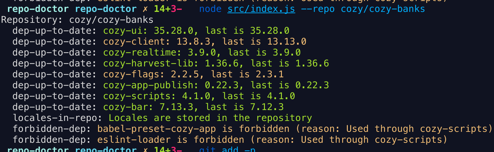

# Repository doctor

> Helps taming multi-repository complexity.

This projects aims at helping developers that manage many different
repositories to express rules and run them on all their repositories
to gather error and warnings. Think "linting" for your repositories.

### Rules

Rules can be implemented and can be controlled through a configuration
file, and can be overrided through the command line.

Example of rules:

- Check the freshness of dependencies
- Forbid the usage of some dependencies

### Reporters

Rules report info / success / warning / error messages that are passed
to a reporter. This lets you those messages either to your console or
to mattermost.

## Usage

```
$ repo-doctor -c config.json
```

```
$ repo-doctor --help
usage: repo-doctor [-h] [--repo REPO] [--dep DEP]
                   [--reporter {console,mattermost}] [--config CONFIG]
                   [--rule RULE]
                   

Optional arguments:
  -h, --help            Show this help message and exit.
  --repo REPO           Run rules only on a repository
  --dep DEP             Run rules only on selected dependencies
  --reporter {console,mattermost}
                        Where to send the output (by default: console)
  --config CONFIG       Path to config
  --rule RULE           Run only selected rule
```

## Config example

See [the example config](./examples/repo-doctor.json).

## Screenshots

 
